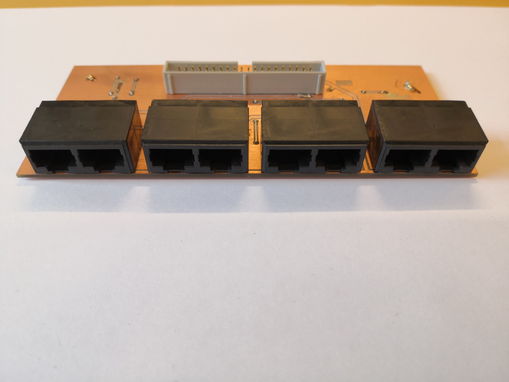
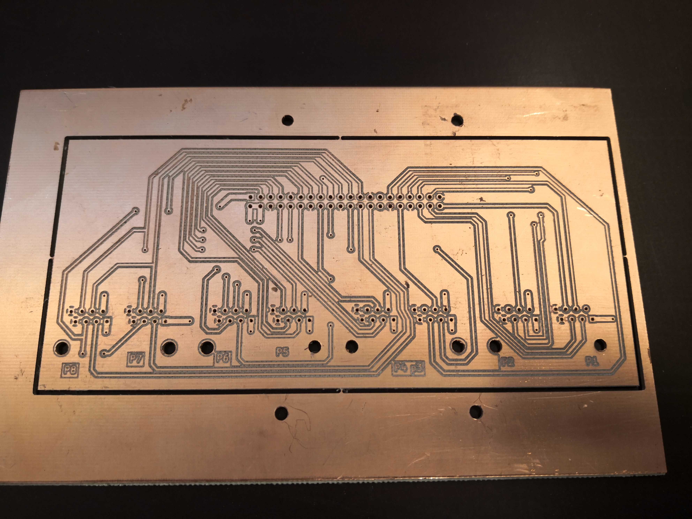

# rpi-pcb is a Breakout board for raspberry pi.
With this breakout board you get eight rj45 ports with both 5v and 3.3v and three GPIOs in each port (exept port 8).
The various features of the the pins have been distributed nicely in a way that I think makes sense so for instance: 
 * Hardware SPI pins are all an port 1
 * Hardware I2C pins on port 5
 * Port 2, 3 and 4 each have a hardware pwm and gpclk pin
 * Port 6 have the UART tx and rx pins 
 * Port 7 and 8 have a shared SPI interface each with their own chip select pin.

See The full pinout [in the included pdf documentation](8xRJ45%20breakout%20board%20for%20raspberry%20pi%20-%20pinout.pdf)

    

## Box  
The repository also includes a nice lasercut box that fits snugly around the pcb.  
  

